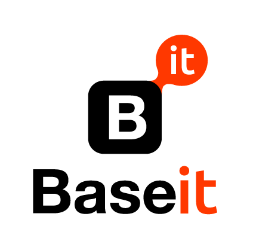

# 🚀 InfraCore - Landing Page de Infraestructura Digital

<div align="center">



**Landing page moderna y profesional para servicios de infraestructura digital**

[](https://reactjs.org/)
[](https://www.typescriptlang.org/)
[](https://nodejs.org/)
[](https://vercel.com/)
[](https://render.com/)

[🌐 Demo en Vivo](https://infracore-web.vercel.app) | [📧 Contacto](mailto:contacto@infracore.com.ar)

</div>

---

## 📋 Descripción

**InfraCore** es una landing page moderna y completamente funcional para una empresa de infraestructura digital. El proyecto incluye un frontend React con TypeScript, un backend Node.js robusto, y está desplegado en la nube con funcionalidades completas de SEO, formularios de contacto y envío de emails.

### ✨ Características Principales

- 🎨 **Diseño Moderno**: Interfaz limpia y profesional con animaciones suaves
- 📱 **Totalmente Responsivo**: Optimizado para todos los dispositivos
- ⚡ **Rendimiento Optimizado**: Carga rápida y experiencia fluida
- 🔍 **SEO Optimizado**: Visible en motores de búsqueda
- 📧 **Formulario Funcional**: Envío de emails reales
- 🛡️ **Seguridad**: Validación de datos y protección CORS
- 🚀 **Despliegue Automático**: CI/CD con GitHub, Vercel y Render

---

## 🏗️ Arquitectura del Proyecto

```
infraCore-landing/
├── 📁 frontend/ (Vercel)
│   ├── React + TypeScript
│   ├── Tailwind CSS
│   ├── React Router
│   └── Componentes modulares
├── 📁 backend/ (Render)
│   ├── Node.js + Express
│   ├── Brevo API (emails)
│   ├── Middleware de seguridad
│   └── Validación de datos
└── 📁 deployment/
    ├── Vercel (frontend)
    ├── Render (backend)
    └── Variables de entorno
```

---

## 🛠️ Tecnologías Utilizadas

### Frontend
- **React 19.1.1** - Biblioteca de UI
- **TypeScript 5.8.3** - Tipado estático
- **Vite 7.1.2** - Build tool y dev server
- **Tailwind CSS 3.4.0** - Framework de CSS
- **React Router DOM 7.8.2** - Enrutamiento
- **Lucide React 0.541.0** - Iconos
- **Animate.css 4.1.1** - Animaciones

### Backend
- **Node.js 18+** - Runtime de JavaScript
- **Express 4.18.2** - Framework web
- **Nodemailer 6.9.7** - Envío de emails
- **Brevo API 3.0.1** - Servicio de emails
- **CORS 2.8.5** - Política de origen cruzado
- **Helmet 7.1.0** - Seguridad HTTP
- **Express Rate Limit 7.1.5** - Limitación de requests

### Herramientas de Desarrollo
- **ESLint 9.33.0** - Linter de código
- **PostCSS 8.5.6** - Procesador de CSS
- **Autoprefixer 10.4.21** - Prefijos CSS automáticos
- **Jest 29.7.0** - Testing framework

### Despliegue y DevOps
- **Vercel** - Hosting del frontend
- **Render** - Hosting del backend
- **GitHub** - Control de versiones
- **GitHub Actions** - CI/CD automático

---

## 🚀 Instalación y Configuración

### Prerrequisitos
- Node.js 18+ 
- npm o yarn
- Cuenta de Brevo (para emails)
- Cuentas de Vercel y Render (para despliegue)

### 1. Clonar el Repositorio
```bash
git clone https://github.com/tu-usuario/infracore-landing.git
cd infracore-landing
```

### 2. Instalar Dependencias del Frontend
```bash
npm install
```

### 3. Instalar Dependencias del Backend
```bash
cd backend
npm install
```

### 4. Configurar Variables de Entorno

#### Frontend (.env)
```env
VITE_API_URL=https://tu-backend.onrender.com
VITE_SITE_URL=https://infracore-web.vercel.app
```

#### Backend (.env)
```env
NODE_ENV=production
PORT=3001
BREVO_API_KEY=tu_api_key_de_brevo
EMAIL_FROM=InfraCore <noreply@infracore.com.ar>
EMAIL_TO=contacto@infracore.com.ar
CORS_ORIGIN=https://infracore-web.vercel.app
```

### 5. Ejecutar en Desarrollo

#### Frontend
```bash
npm run dev
# Abre http://localhost:5173
```

#### Backend
```bash
cd backend
npm run dev
# Backend en http://localhost:3001
```

---

## 📁 Estructura del Proyecto

```
infraCore-landing/
├── 📁 public/
│   ├── favicon.png
│   └── images/
├── 📁 src/
│   ├── 📁 components/
│   │   ├── 📁 sections/     # Componentes de secciones
│   │   └── 📁 ui/          # Componentes reutilizables
│   ├── 📁 hooks/           # Custom hooks
│   ├── 📁 styles/          # Estilos globales
│   ├── 📁 utils/           # Utilidades
│   └── 📁 types/           # Tipos TypeScript
├── 📁 backend/
│   ├── 📁 src/
│   │   ├── 📁 middleware/  # Middleware de Express
│   │   ├── 📁 routes/      # Rutas de la API
│   │   └── 📁 services/    # Servicios (email, etc.)
│   └── package.json
├── 📄 package.json
├── 📄 tailwind.config.js
├── 📄 vite.config.ts
└── 📄 README.md
```

---

## 🌐 Despliegue

### Frontend (Vercel)
1. Conecta tu repositorio de GitHub a Vercel
2. Configura las variables de entorno
3. Deploy automático en cada push

### Backend (Render)
1. Conecta tu repositorio de GitHub a Render
2. Configura las variables de entorno
3. Deploy automático en cada push

### URLs de Producción
- **Frontend**: https://infracore-web.vercel.app
- **Backend**: https://infracore-backend.onrender.com
- **API Health**: https://infracore-backend.onrender.com/health

---

## 🔧 Scripts Disponibles

### Frontend
```bash
npm run dev          # Servidor de desarrollo
npm run build        # Construir para producción
npm run preview      # Preview de la build
npm run lint         # Linter de código
```

### Backend
```bash
npm start            # Iniciar servidor
npm run dev          # Servidor con nodemon
npm test             # Ejecutar tests
npm run test:brevo   # Test de integración Brevo
```

---

## 📧 Configuración de Emails

El proyecto utiliza **Brevo** (anteriormente Sendinblue) para el envío de emails:

1. Crea una cuenta en [Brevo](https://www.brevo.com)
2. Obtén tu API key en Settings > SMTP & API
3. Configura la variable `BREVO_API_KEY` en Render
4. Configura `EMAIL_FROM` y `EMAIL_TO`

**Límites gratuitos**: 300 emails/día

---

## 🔍 SEO y Optimización

### Meta Tags
- Títulos optimizados para cada página
- Descripciones meta personalizadas
- Open Graph para redes sociales
- Twitter Cards
- Schema.org para datos estructurados

### Performance
- Lazy loading de imágenes
- Compresión de assets
- Minificación de CSS/JS
- CDN global (Vercel)

### Accesibilidad
- Textos descriptivos en enlaces
- Alt text en imágenes
- Navegación por teclado
- Contraste de colores optimizado

---

## 🛡️ Seguridad

- **Helmet.js**: Headers de seguridad HTTP
- **Rate Limiting**: Protección contra spam
- **CORS**: Configuración de orígenes permitidos
- **Validación**: Sanitización de inputs
- **HTTPS**: Certificados SSL automáticos

---

## 📊 Características Técnicas

### Frontend
- ⚡ **Vite**: Build tool ultra-rápido
- 🎨 **Tailwind CSS**: Utility-first CSS
- 📱 **Responsive**: Mobile-first design
- 🔄 **React Router**: SPA navigation
- 🎭 **Animaciones**: Transiciones suaves

### Backend
- 🚀 **Express**: Framework web minimalista
- 📧 **Nodemailer**: Envío de emails robusto
- 🛡️ **Middleware**: Seguridad y validación
- 📝 **Logging**: Morgan para logs HTTP
- 🔒 **Rate Limiting**: Protección contra abuso

---

## 🤝 Contribución

1. Fork el proyecto
2. Crea una rama para tu feature (`git checkout -b feature/AmazingFeature`)
3. Commit tus cambios (`git commit -m 'Add some AmazingFeature'`)
4. Push a la rama (`git push origin feature/AmazingFeature`)
5. Abre un Pull Request

---

## 📄 Licencia

Este proyecto está bajo la Licencia MIT. Ver el archivo [LICENSE](LICENSE) para más detalles.

---

## 👨‍💻 Autor

**InfraCore Team**
- Email: contacto@infracore.com.ar
- LinkedIn: [InfraCore](https://www.linkedin.com)
- GitHub: [@tu-usuario](https://github.com/tu-usuario)

---

## 🙏 Agradecimientos

- [React](https://reactjs.org/) - Biblioteca de UI
- [Tailwind CSS](https://tailwindcss.com/) - Framework de CSS
- [Vercel](https://vercel.com/) - Hosting del frontend
- [Render](https://render.com/) - Hosting del backend
- [Brevo](https://www.brevo.com/) - Servicio de emails

---

<div align="center">

**⭐ Si te gusta este proyecto, ¡dale una estrella! ⭐**

[](https://github.com/tu-usuario/infracore-landing)

</div>